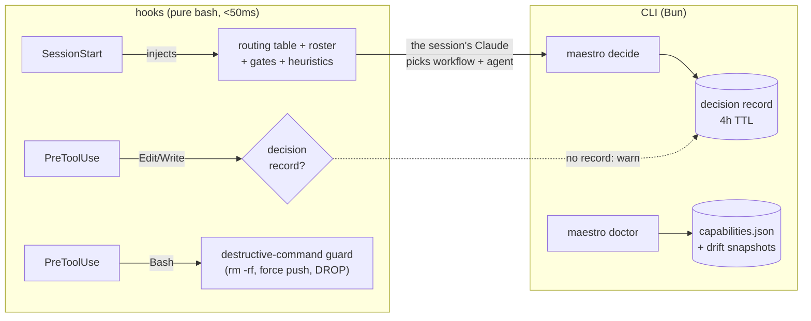

# Maestro

**A MoE routing layer for Claude Code** — deterministic hooks, a declarative routing
table, and a roster of cost-tiered agents.

[](https://github.com/tropeks/Maestro/actions/workflows/ci.yml)


*Leia em [português](README.pt-BR.md). Internal docs (`docs/`) are in pt-BR.*

> **Philosophy:** deterministic rails, AI at the edges. Hooks guarantee **THAT** a
> routing decision happens; the session's Claude decides **WHAT** to do, guided by
> the table. No LLM on the critical path, no network on the critical path, no
> component that blocks work when it fails.

## The problem

In a long Claude Code session, the main model tends to do everything itself — in the
most expensive context in the house. A mechanical one-line bugfix costs the same
premium reasoning as an architecture decision. Maestro inverts the default:
**delegating is the rule, working directly is the exception**, and each task drops to
the cheapest model that can handle it. Measured in a blind eval, this inversion took
routing accuracy from 73% to 100% (15/15, two independent judges).

## How it works



1. **SessionStart** injects a `<maestro-routing>` block (~6KB, budget enforced by a
   tested ratchet): intent → workflow routes, step → executor bindings, delegation
   heuristics, human gates, and the roster filtered by the project's `.maestro.yaml`.
2. The session's Claude records its decision before editing code:

   ```bash
   maestro decide --session <id> --workflow fix --mode subagent \
                  --agents golang-pro --reason "bug in 1 Go module"
   ```

3. **PreToolUse** checks: editing code without a valid decision record raises a
   warning on every edit (`gate.mode: warn` is the default; promotion to `block` is
   one line of config, made with dogfood data — not on faith).
4. `maestro log --summary` closes the loop: manual-override rate, model distribution
   per task — the instrument that tells you whether routing is actually working.

### Situational awareness — no more cold-start sweeps

A fresh session normally re-scans the repo to figure out where the project
stands. Maestro fixes this with a **project brief**: the outgoing session writes
a short narrative (`maestro brief --write` — what was in flight, open decisions,
next step), the CLI stamps it with timestamp + git HEAD + a content fingerprint,
and SessionStart injects a ~300-byte pointer with an honest freshness verdict:

```
## Projeto
brief: FRESH (2h, HEAD 73394c8) → read ~/.maestro/briefs/… BEFORE sweeping the repo
memória: recall supermemory with containerTag sm_project_Maestro
```

A stale brief says so — "STALE (3 commits behind) → the brief gives context; git
gives the truth". The rails guarantee THAT the state exists and is fresh; the AI
writes WHAT it says. The brief is local working state — never memory, never logged.

The same freshness treatment covers **structure**: if the project has a
[graphify](https://github.com/tropeks) knowledge graph (`graphify-out/`), the
injection points at it — fresh → "answer structure via graph query BEFORE
reading code"; stale → "do not trust it". A versioned operator routine
(`bin/maestro-graph-refresh`, weekly crontab) incrementally refreshes only
stale graphs, capped per run. A stale map is worse than no map.

### Habit sensors — anti-slop nudges at edit time

After every code edit, a PostToolUse hook runs 14 pure-awk **habit sensors** on the
edited file — swallowed errors, `@ts-ignore`/bare `# noqa` suppressions, `as any`
escapes, slop-signature comments ("in a real implementation…"), debug leftovers,
commented-out code, skipped tests, oversized functions, and a session-level
*test-gap* sensor (N source edits, zero test edits). Each finding ships **with its
coaching guide** (`config/habit-guides/`) so the agent fixes the design instead of
gaming the metric — the [habit-hooks](https://github.com/habit-hooks/habit-hooks)
pattern, rebuilt inside Maestro's boundaries (pure bash, zero deps, ~40ms, warn-only,
15-min cooldown per file+smell). `maestro habits` runs the same sensors over the diff
for review and CI; `habits:` in `.maestro.yaml` tunes the set per project.
`maestro habits --baseline` pins a per-smell ratchet (`.maestro-habits.tsv`) — CI
fails only on slop that EXCEEDS the baseline — and the `/maestro:deslop` slash
command pays the debt down in reviewable, test-gated batches with tiered agents.

### Docs as contract — the product spec that sessions actually follow

Declare canonical docs in `.maestro.yaml`; each doc's frontmatter states the
paths it governs (`covers:` globs). Drift is mechanical and commit-based:
touching a governed area without amending the doc counts — settled by an
amendment or by re-attesting with `reviewed: <sha>` (no cosmetic edits), and
ratcheted so brownfield debt doesn't scream while new drift fails CI. The
citation rule is enforced where research says it works: a short positive rule
at session start plus a single late nudge on the first edit inside a governed
area (instruction-following decays measurably within a session). Work orders
name the doc that authorizes them.

### Work orders — directing work you're not watching

A **work order** travels with the target repo (`.maestro/orders/NNN.md`):
objective, acceptance criteria, frozen zones (paths the executor must not
touch — autonomous sessions get blocked there, humans get warned), Ask-First
triggers, a declared budget, and the expected branch. Its state is **derived,
never self-declared**: open → executing (the branch exists) → proven (an
evidence receipt whose content fingerprint matches the branch tip — a commit
after the proof demotes it automatically) → accepted (the director's explicit
sign-off, which requires proof). New sessions in the project discover pending
orders through the injection. The executor never closes its own order.

### The learning loop — batch, never at runtime

Maestro never self-tunes at runtime (rails stay deterministic); it learns in
batches: telemetry → `maestro retro` (override rate, gate stats, smell
frequencies, **outcomes** — `maestro outcome` closes each decision with
accepted/rework/reverted) → `/maestro:retro` proposes concrete diffs with the
signal that justifies each → the eval-on-diff exam kills any proposal that
worsens the table → a versioned commit is the learning. With explicit,
scoped, TTL-bound **consent** (`maestro consent --grant routing-table|roster`),
the AI may apply those config diffs itself — consent unlocks DATA, never the
machine: hooks, CLI, and gate have no consentable scope, by construction
(ADR-003 v1.2), and the doctor surfaces any active consent as a warning.

## Roster — the model proportional to the role

| agent | model | when |
|---|---|---|
| `dev-junior` | haiku | mechanical task with closed scope and objective criteria |
| `dev-pleno` | sonnet | feature/bugfix that requires judgment |
| `engenheiro` | sonnet | architecture and planning — delivers trade-offs, not code |
| `arquiteto` | **opus** | critical structural decisions only (cross-system, data migration, concurrency, security) — the description is the cost gate |
| `revisor` | sonnet | **read-only** review — no Write, Edit, or Bash |
| `qa` | sonnet | functional testing and evidence — never implements the fix |
| `golang-pro` · `python-pro` · `typescript-pro` · `postgres-pro` | sonnet | the target's language beats the seniority profile |

The four specialists are adapted from [wshobson/agents](https://github.com/wshobson/agents)
(MIT), with the originals pinned by commit under `vendor/` — which is read-only and
verified against a `sha256` manifest on every `doctor` run.

A `.maestro.yaml` at the project root narrows the active roster:

```yaml
version: 1
project: remedix
languages: [go]
experts: [golang-pro]   # only this one shows up in the injection
```

## Workflows and gates

| intent (examples) | workflow | steps | human gate |
|---|---|---|---|
| "it broke, fix it" | `fix` | investigate → implement → review | — |
| "add, implement" | `feature` | plan → implement → review → qa | plan |
| "clean up, reorganize" | `refactor` | plan → implement → review | plan |
| "deploy, publish" | `ship` | ship | ship |
| "security, audit" | `audit` | audit | — |
| "test, validate" | `verify` | qa | — |
| "review the PR" | `codereview` | review | — |

Every step has a declared **binding** (`skill:` · `agent:` · `native:`) in
`config/routing-table.yaml` — a versioned schema with **eval-on-diff**: a route
mutation fails CI naming the case whose verdict changed, before → after.

Human gates follow risk, not bureaucracy: they stop **only** the near-irreversible
(real production, billing, auth/secrets, destructive migrations, force push). In
private development with the change verified by tests, commit, branch push, and PR
flow without asking — with the decision on record.

## Install

```bash
git clone https://github.com/tropeks/Maestro ~/dev/Maestro
claude   # inside Claude Code:
# /plugin marketplace add ~/dev/Maestro
# /plugin install maestro@maestro
```

Runtime dependencies: `bash`, `jq`, `flock` (hooks) and [Bun](https://bun.sh) (CLI).
The hooks never invoke Bun — if Bun disappears, the CLI degrades with a message
citing the last `doctor` run; the rails stay up.

## Update

Maestro keeps itself current. The plugin runs straight from the clone, so every
session start does a `git fetch` (5s timeout, at most once a day, silent on failure)
and fast-forwards to `origin/main` when that is strictly safe: clean tree, no local
commits ahead, on `main`. The session is then born on the new version — the new hook
re-executes itself. A development machine (dirty tree or unpushed commits) is never
overwritten; the session just gets a one-line "push, don't pull" notice.

```bash
maestro upgrade                     # fetch + fast-forward now, show the CHANGELOG delta, run doctor
maestro upgrade --check             # measure only: exit 0 current · 1 available/blocked · 2 failed
maestro upgrade --rollback          # git reset --keep to the previous version
maestro upgrade --set auto_upgrade=false   # notify only; also update_check, update_interval_hours
```

Silence never means "up to date": the result of every check, including failures, lands
in `~/.maestro/update-state`, and `maestro doctor` reports it. `MAESTRO_NO_UPDATE_CHECK=1`
turns the automatic check off.

## Cross-machine telemetry (optional)

With more than one machine running Maestro, each retro only sees its own box. E20
uses a private git repo as the bus: at the end of each session (once a day, timed
out, silent when the network fails) the machine publishes only its `routing*.jsonl`
under `logs/<host-id>/`, and `maestro retro --all` aggregates the union.

```bash
maestro telemetry --remote git@github.com:you/maestro-telemetry.git   # opt in on this machine
maestro telemetry --push        # publish now
maestro retro --all             # retro across machines
maestro telemetry --off         # opt out on this machine
```

Only the log travels, and it is metadata by construction. Records, briefs, evidence
and consents never leave the machine.

## Validate

```bash
bin/maestro doctor        # 31 checks; --ci for pipelines
bash tests/run-all.sh     # full suite: 1075 assertions, hermetic
```

The `doctor` doesn't trust — it measures: it runs the injection hook for real and
counts the bytes; compares resolved bindings against the previous run's snapshot
(`binding-resolution-drift`); verifies `vendor/` against the pinned manifest; and
compares the installed plugin copy with the repo **by content, byte for byte** —
because an identical version number once hid six commits of difference. Everything
it establishes becomes integer facts in an envelope (`capabilities.json`) that
consumers read later.

CI runs exactly this on every push/PR, plus `shellcheck` over `hooks/`, `bin/`, and
`tests/` (blocking gate at `error`; the full inventory lands as PR annotations while
the debt is being paid down).

## Hard boundaries

- **`hooks/` is pure bash** — never invokes Bun, never imports `src/`. NFR: <50ms.
- **Kill switch:** `MAESTRO_OFF=1` disables everything instantly. Any component
  failure degrades to the manual flow with exit 0 — Maestro **never** blocks work by
  being broken.
- **Log privacy:** `~/.maestro/logs/routing.jsonl` carries metadata only, with typed
  keys and a closed vocabulary — never the prompt text, never a full file path (only
  the extension). No key accepts `/`.
- **No floats in cost metrics** (integer tokens/cents), **no network on the critical
  path** (the only network call is the auto-update fetch: timed out, rate-limited,
  silent on failure), **`vendor/` is read-only**.
- **Self-protection:** the gate always blocks — even with a decision on record —
  edits to `.claude/` and `.github/workflows/` in any project, and to `hooks/`,
  `bin/`, `src/`, `agents/`, `config/routing-table.yaml`, and `.claude-plugin/`
  under the plugin root. The router doesn't rewrite its own rules; agents edit
  `docs/`, `tests/`, and this README — the gate and the CLI belong to the human.

## Documentation

| doc | what |
|---|---|
| [`docs/architecture/ARCHITECTURE.md`](docs/architecture/ARCHITECTURE.md) | ADRs — the decisions and their whys |
| [`docs/architecture/DATA_MODEL.md`](docs/architecture/DATA_MODEL.md) | schemas: decision record, log, envelope |
| [`docs/architecture/API_SPEC.md`](docs/architecture/API_SPEC.md) | hook and CLI contracts |
| [`docs/architecture/EPICS.md`](docs/architecture/EPICS.md) | scope — nothing gets in without an amendment here |
| [`docs/decision-log.md`](docs/decision-log.md) | diary of decisions, incidents, and corrections |

## License

There are **two different licenses** in this repository, and they don't mix:

| what | license | holder |
|---|---|---|
| Maestro itself — `hooks/`, `bin/`, `src/`, `config/`, `docs/`, `tests/`, and the 5 first-party agents | MIT ([`LICENSE`](LICENSE)) | © 2026 Romulo de Jesus Costa |
| `vendor/wshobson-agents/` — verbatim copies, pinned by commit in `PINNED.md` | upstream MIT | © 2024 Seth Hobson |
| `agents/{golang,python,typescript,postgres}-pro.md` — adaptations (derivative works) | upstream MIT | © 2024 Seth Hobson, adapted |

Choosing MIT for the project **does not relicense** the vendored material: it remains
under Seth Hobson's MIT, with his copyright notice preserved in
`vendor/wshobson-agents/LICENSE` and the provenance in each adaptation's frontmatter.
