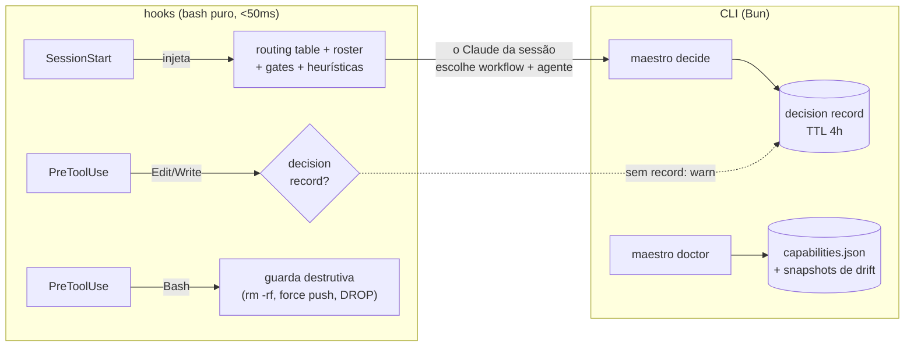

# Maestro

**Camada de roteamento MoE para o Claude Code** — hooks determinísticos, uma routing
table declarativa e um roster de agentes tierizados por custo.

[](https://github.com/tropeks/Maestro/actions/workflows/ci.yml)


*Read this in [English](README.md) — a versão principal do repo.*

> **Filosofia:** trilhos determinísticos, IA nas bordas. Os hooks garantem **QUE** a
> decisão de roteamento acontece; o Claude da sessão decide **O QUE** fazer, guiado
> pela tabela. Nenhum LLM no caminho crítico, nenhuma rede em runtime, nenhum
> componente que bloqueie trabalho ao falhar.

## O problema

Numa sessão longa do Claude Code, o modelo principal tende a fazer tudo sozinho — no
contexto mais caro da casa. Um bugfix mecânico de uma linha custa o mesmo raciocínio
premium que uma decisão de arquitetura. O Maestro inverte o padrão: **delegar é a
regra, executar direto é a exceção**, e a tarefa desce para o modelo mais barato que
dá conta dela — medido em eval cego, essa inversão levou o acerto de roteamento de
73% para 100% (15/15, dois juízes independentes).

## Como funciona



1. **SessionStart** injeta um bloco `<maestro-routing>` (~6KB, orçamento com ratchet
   testado): rotas de intenção → workflow, bindings step → executor, heurísticas de
   delegação, gates humanos e o roster filtrado pelo `.maestro.yaml` do projeto.
2. O Claude da sessão registra a decisão antes de editar código:

   ```bash
   maestro decide --session <id> --workflow fix --mode subagent \
                  --agents golang-pro --reason "bug em 1 módulo Go"
   ```

3. **PreToolUse** confere: edição de código sem decision record válido gera aviso em
   toda edição (`gate.mode: warn` é o default; a promoção a `block` é uma linha de
   config, tomada com dados de dogfood — não por fé).
4. `maestro log --summary` fecha o loop: taxa de override manual, distribuição de
   modelo por tarefa — o instrumento que diz se o roteamento está funcionando.

### Inteligência situacional — fim da varredura de cold start

Sessão nova normalmente re-varre o repo para descobrir onde o projeto está. O
Maestro resolve com um **brief de projeto**: a sessão que sai escreve uma
narrativa curta (`maestro brief --write` — o que estava em curso, decisões
abertas, próximo passo), o CLI carimba com timestamp + HEAD do git + fingerprint
de conteúdo, e o SessionStart injeta um ponteiro de ~300 bytes com veredito
honesto de freshness:

```
## Projeto
brief: FRESCO (2h, HEAD 73394c8) → leia ~/.maestro/briefs/… ANTES de varrer o repo
memória: recall no supermemory com containerTag sm_project_Maestro
```

Brief velho diz que é velho — "STALE (3 commits atrás) → o brief dá o contexto;
o git dá a verdade". Os trilhos garantem QUE o estado existe e está fresco; a IA
escreve O QUE ele diz. O brief é estado local de trabalho — nunca memória, nunca log.

## Roster — o modelo proporcional ao papel

| agente | modelo | quando |
|---|---|---|
| `dev-junior` | haiku | tarefa mecânica de escopo fechado e critério objetivo |
| `dev-pleno` | sonnet | feature/bugfix que exige julgamento |
| `engenheiro` | sonnet | arquitetura e plano — entrega trade-offs, não código |
| `revisor` | sonnet | review **read-only** — sem Write, Edit ou Bash |
| `qa` | sonnet | teste funcional e evidência — não implementa correção |
| `golang-pro` · `python-pro` · `typescript-pro` · `postgres-pro` | sonnet | a linguagem do alvo vence o perfil de senioridade |

Os quatro especialistas são adaptados de [wshobson/agents](https://github.com/wshobson/agents)
(MIT), com os originais pinados por commit em `vendor/` — que é read-only e verificado
por manifesto `sha256` a cada `doctor`.

Um `.maestro.yaml` na raiz do projeto restringe o roster ativo:

```yaml
version: 1
project: remedix
languages: [go]
experts: [golang-pro]   # só ele aparece na injeção
```

## Workflows e gates

| intenção (exemplos) | workflow | steps | gate humano |
|---|---|---|---|
| "quebrou, corrige" | `fix` | investigate → implement → review | — |
| "adiciona, implementa" | `feature` | plan → implement → review → qa | plano |
| "limpa, reorganiza" | `refactor` | plan → implement → review | plano |
| "deploya, publica" | `ship` | ship | ship |
| "segurança, auditoria" | `audit` | audit | — |
| "testa, valida" | `verify` | qa | — |
| "revisa o PR" | `codereview` | review | — |

Cada step tem um **binding** declarado (`skill:` · `agent:` · `native:`) na
`config/routing-table.yaml` — schema versionado, com **eval-on-diff**: mutação de
rota reprova a CI nomeando o caso que mudou de veredito e o antes → depois.

Os gates humanos seguem risco, não burocracia: param **só** o quase-irreversível
(produção real, billing, auth/secrets, migração destrutiva, force push). Em
desenvolvimento privado com a mudança verificada por testes, commit, push em branch
e PR fluem sem pergunta — com a decisão registrada.

## Instalar

```bash
git clone https://github.com/tropeks/Maestro ~/dev/Maestro
claude   # dentro do Claude Code:
# /plugin marketplace add ~/dev/Maestro
# /plugin install maestro@maestro
```

Dependências de runtime: `bash`, `jq`, `flock` (hooks) e [Bun](https://bun.sh) (CLI).
Os hooks nunca invocam Bun — se o Bun sumir, o CLI degrada com mensagem citando o
último `doctor`; os trilhos continuam de pé.

## Validar

```bash
bin/maestro doctor        # 31 checagens; --ci para pipeline
bash tests/run-all.sh     # suíte completa: 1075 asserções, hermética
```

O `doctor` não confia — mede: roda o hook de injeção de verdade e conta os bytes;
compara os bindings resolvidos contra o snapshot da última rodada
(`binding-resolution-drift`); verifica o `vendor/` contra o manifesto pinado; compara
a cópia instalada do plugin com o repo **por conteúdo, byte a byte** — porque versão
igual já escondeu seis commits de diferença. Tudo que ele apura vira fatos inteiros
num envelope (`capabilities.json`) que os consumidores leem depois.

A CI roda exatamente isso a cada push/PR, mais `shellcheck` em `hooks/`, `bin/` e
`tests/` (gate bloqueante em `error`; o inventário completo sai como anotação no PR
enquanto a dívida não fecha).

## Fronteiras invioláveis

- **`hooks/` é bash puro** — nunca invoca Bun, nunca importa `src/`. NFR: <50ms.
- **Kill-switch:** `MAESTRO_OFF=1` desativa tudo instantaneamente. Falha de qualquer
  componente degrada para o fluxo manual com exit 0 — o Maestro **nunca** bloqueia
  trabalho por estar quebrado.
- **Privacidade do log:** `~/.maestro/logs/routing.jsonl` carrega só metadados com
  vocabulário fechado — jamais o texto do prompt, jamais caminho completo de arquivo
  (só a extensão). Nenhuma chave aceita `/`.
- **Sem float em métrica de custo** (inteiros de tokens/centavos), **sem rede em
  runtime**, **`vendor/` read-only**.
- **Autoproteção:** o gate bloqueia sempre — mesmo com decisão registrada — edição de
  `.claude/` e `.github/workflows/` em qualquer projeto, e de `hooks/`, `bin/`,
  `src/`, `agents/`, `config/routing-table.yaml` e `.claude-plugin/` sob a raiz do
  plugin. O roteador não reescreve as próprias regras; agentes editam `docs/`,
  `tests/` e este README — o gate e o CLI são do humano.

## Documentação

| doc | o quê |
|---|---|
| [`docs/architecture/ARCHITECTURE.md`](docs/architecture/ARCHITECTURE.md) | ADRs — as decisões e os porquês |
| [`docs/architecture/DATA_MODEL.md`](docs/architecture/DATA_MODEL.md) | schemas: decision record, log, envelope |
| [`docs/architecture/API_SPEC.md`](docs/architecture/API_SPEC.md) | contratos dos hooks e do CLI |
| [`docs/architecture/EPICS.md`](docs/architecture/EPICS.md) | escopo — nada entra sem emenda aqui |
| [`docs/decision-log.md`](docs/decision-log.md) | diário de decisões, incidentes e correções |

## Licença

São **duas licenças diferentes** no mesmo repositório, e elas não se misturam:

| o quê | licença | titular |
|---|---|---|
| O Maestro — `hooks/`, `bin/`, `src/`, `config/`, `docs/`, `tests/` e os 5 agentes próprios | MIT ([`LICENSE`](LICENSE)) | © 2026 Romulo de Jesus Costa |
| `vendor/wshobson-agents/` — cópias verbatim, pinadas por commit em `PINNED.md` | MIT do upstream | © 2024 Seth Hobson |
| `agents/{golang,python,typescript,postgres}-pro.md` — adaptações (obras derivadas) | MIT do upstream | © 2024 Seth Hobson, adaptado |

Escolher MIT para o projeto **não relicencia** o material vendorizado: ele continua
sob a MIT do Seth Hobson, com o aviso de copyright preservado em
`vendor/wshobson-agents/LICENSE` e a procedência no frontmatter de cada adaptação.
